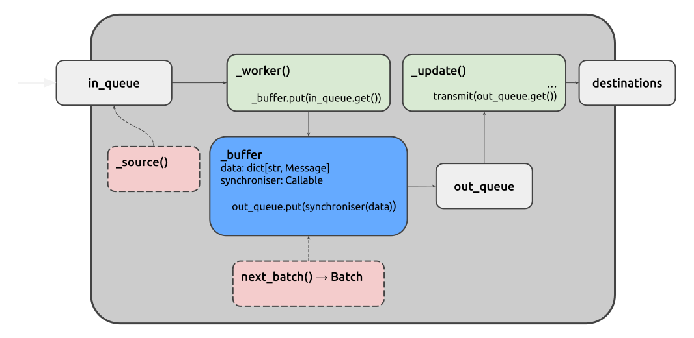

Nodes
=====

Juturna's basic node is the fundamental abstraction upon which Juturna's data
processing pipelines can be built. It embodies a simple design philosophy:
complex data flows can be made robust, testable, and composable by treating
each processing unit as an independent, message-driven actor with well-defined
boundaries.

A simple message processor
--------------------------

At its essence, a node is a typed message transformer: it receives messages of
type ``T_Input``, performs a designed task, and optionally emits messages of
type ``T_Output``. This generic type signature is not just decorative, but
rather it enforces a contract that makes pipeline composition predictable and
type-safe. Whether a node generates data from scratch, enriches incoming
records, or writes results to disk, it always conforms to this same conceptual
shape.

.. admonition:: Multi-input nodes and clashing types (|version|-|release|)
    :class: :ATTENTION:

    Whilst node input type finds an easy match for single-input nodes, there
    might be cases where a node receives messages of heterogeneous types (think
    of a node that needs to mix audio and video data). In this case, the message
    typing could not be respected, so be aware when you design custom nodes.

In Juturna, a node can play three distinct roles, all shareing the same
underlying implementation:

- **source nodes** originate data, pulling from APIs, databases, live streams,
  or generating synthetic content;
- **processor nodes** (often called ``proc`` in the codebase) sit in the middle
  of pipelines, transforming messages and making them available for intermediate
  steps;
- **sink nodes** terminate data flows, persisting results or delivering them to
  external systems.

This tripartite division reflects a classic pattern in stream processing, but
Juturna unifies them under one class because the differences are primarily about
how a node obtains its input, not how it processes it. A source node simply has
its input generated by a dedicated thread rather than received from upstream
nodes.

It is also worh mentioning that the taxonomy of node roles is purely conceptual,
and does not reflect on how concrete nodes are instantiated. More node groups
can be created, as long as the node type specified in the node configuration
matches the folder where the node code lives (we'll get to that later).

The node structure and setup is reflected into its configuration object:

.. code-block:: json

  {
    "name": "my_awesome_node",
    "type": "proc",
    "mark": "node_module_name",
    "configuration": { }
  }

Threading model
---------------

Every node runs up to three independent threads, each with a singular
responsibility. This separation of concerns is the key to the framework's
responsiveness and fault isolation.

The ``_worker`` thread is the node's inbound gatekeeper. It runs in every node,
and blocks on the node's inbound queue, waiting for incoming messages from
upstream nodes. When a message arrives, the worker immediately buffers it, thus
decoupling the message reception from its processing. By placing the message
into a buffer rather than processing it directly, the worker thread can quickly
return to listening for new messages, preventing backpressure from rippling
upstream.

.. admonition:: The inbound queue (|version|-|release|)
   :class: :NOTE:

   Nodes and Buffer classes now use FIFO (First-In, First-Out) queues. This
   ensures messages are processed in the order they are produced, even when a
   source node generates data faster than its descendants can consume it. The
   previous LIFO-based design could reorder messages during such bursts, leading
   to incorrect processing. Further refinements to the inbound queue may be
   introduced in the future.

The ``_update`` thread represents the node's processing engine. It consumes
messages from the buffer in batches, not individually. This batching is where
Juturna's synchronisation logic becomes visible. The buffer doesn't simply store
messages, it coordinates them. When a node has multiple upstream origins, the
buffer's synchroniser determines when enough messages have arrived to form a
coherent batch for processing. The default synchroniser implements a simple
passthrough policy, forwarding messages as-is. However, custom synchronisers can
be designed with more complex policies in mind: waiting for matching keys across
streams, enforcing timeouts, or aggregating windows of data. The choice of
synchroniser can be specified in the node configuration using the ``sync`` key.

When a batch is ready, the ``_update`` thread calls the node's ``update()``
method. This is the only place where user-defined processing logic should run,
ensuring that the framework maintains full control over threading, error
boundaries, and lifecycle management.

For source nodes, the ``_source`` thread runs in parallel to the ``_worker`` and
``_update`` threads. Its sole purpose is to repeatedly invoke a user-provided
callable (``_source_f``) and inject the resulting messages into the node's own
queue. The *pre* and *post* sleep modes allow fine-tuning of polling
behavior, such as waiting before generating data (useful for rate-limiting) or
after (useful for ensuring minimum intervals between calls).

In short:

#. A message is pushed in the node's inbound queue - a source node will write
   the message itsels through the ``_source`` thread, while intermediate nodes
   will received messages from other upstream nodes;
#. the ``_worker`` thread pops the received message from the queue, and writes
   it in the node buffer, which is a simple map ``{ node_name: message_list }``;
#. for every new message received, the buffer will invoke the synchroniser, a
   method responsible for aggregating buffered messages in a batch according to
   a specific policy;
#. every time a batch is available, the buffer writes it on an outbound queue;
#. the ``_update`` thread reads on the outbound queue, and whenever a new batch
   is available, it invokes the blocking ``update()`` method, where the actual
   data elaboration and subsequent transmission downstream take place.

Buffer
------

While the ``_worker`` thread uses a simple queue for inbound message transfer,
the buffer sits between worker and update, providing three critical services:

- **Per-origin message tracking**: messages are stored in a dictionary that maps
  node names to message lists, allowing the synchroniser to reason about which
  upstream nodes sent which messages.
- **Synchronisation policy application**: the ``get()`` method on the node
  buffer doesn't dequeue messages, it rather invokes the synchroniser on the
  entire data structure to decide what constitutes a processable batch.
- **Stateful consumption**: the ``_consume`` method on the node buffer pops
  specific messages, based on the synchroniser's *marks*, then places either a
  single message or a batch into the outbound queue.

Having a buffer that decides which messages are ready for processing prevents
the ``update()`` method from being called with partial or inconsistent data when
multiple upstream nodes feed into a single processor.

Synchronising data
------------------

Unless differently specified in the node configuration, a buffer adopts the
passthrough synchronisation policy, that simply lets every available message
move into the outboud queue. However, if a node implements the ``next_batch()``
method, that one will be picked as synchroniser. The synchroniser priority can
be described as follows:

- the default synchroniser for a node is the ``passthrough`` (it will be applied
  for every node without any ``sync`` value in its configuration, nor a
  ``next_batch()`` method implementation);
- if a ``next_batch()`` method is implemented on the node, it will be used
  instead of the default synchroniser (no need to specify anything in the
  configuration, but can be explicitly put there with ``"sync": "local"``).
- any other built-in synchroniser can be set as ``sync`` value in the node
  configuration, and will be used.

.. admonition:: Built-in synchronisers (|version|-|release|)
   :class: :NOTE:

   Currently Juturna only implements a single built-in synchroniser, the
   passthrough one. Stay tuned, more are coming!

Node lifecycle
--------------

A node's life follows a clear progression managed by the pipeline:

.. code-block::

   configure() → warmup() → start() → stop() → destroy()

The ``status`` property, backed by the ``ComponentStatus`` enum, makes this
state machine explicit.

The ``start()`` method's logic reveals the framework's defensive design. It
checks for ``None`` on thread references before spawning new ones, preventing
accidental restarts. Stopping is equally nuanced. The stop sequence puts a
sentinel ``None`` value into the queue, which gracefully unwinds the worker and
update threads.
