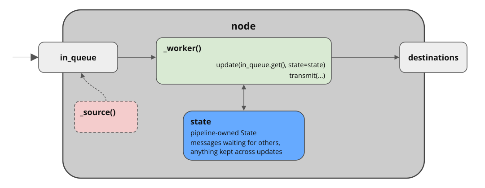

.. _explain_nodes:

Nodes
=====

Juturna's basic node is the fundamental abstraction upon which Juturna's data
processing pipelines can be built. It embodies a simple design philosophy:
complex data flows can be made robust, testable, and composable by treating
each processing unit as an independent, message-driven actor with well-defined
boundaries.

A simple message processor
--------------------------

At its essence, a node is a typed message transformer: it receives messages of
type ``T_Input``, performs a designed task, and optionally emits messages of
type ``T_Output``. This generic type signature is not just decorative, but
rather it enforces a contract that makes pipeline composition predictable and
type-safe. Whether a node generates data from scratch, enriches incoming
records, or writes results to disk, it always conforms to this same conceptual
shape.

.. admonition:: Multi-input nodes and clashing types (|version|-|release|)
    :class: :NOTE:

    Whilst node input type finds an easy match for single-input nodes, there
    might be cases where a node receives messages of heterogeneous types (think
    of a node that needs to mix audio and video data). In this case, the node is
    very likely to receive a ``Batch`` message, which is nothing but a container
    of multiple messages. As a message batch represents a type of message
    itself, it is not important that the messages within are of different types,
    just as long as the node developer know what to do with them!

In Juturna, a node can play three distinct roles, all shareing the same
underlying implementation:

- **source nodes** originate data, pulling from APIs, databases, live streams,
  or generating synthetic content;
- **processor nodes** (often called ``proc`` in the codebase) sit in the middle
  of pipelines, transforming messages and making them available for intermediate
  steps;
- **sink nodes** terminate data flows, persisting results or delivering them to
  external systems.

This tripartite division reflects a classic pattern in stream processing, but
Juturna unifies them under one class because the differences are primarily about
how a node obtains its input, not how it processes it. A source node simply has
its input generated by a dedicated thread rather than received from upstream
nodes.

It is also worh mentioning that the taxonomy of node roles is purely conceptual,
and does not reflect on how concrete nodes are instantiated. More node groups
can be created, as long as the node type specified in the node configuration
matches the folder where the node code lives (we'll get to that later).

The node structure and setup is reflected into its configuration object:

.. code-block:: json

  {
    "name": "my_awesome_node",
    "type": "proc",
    "mark": "node_module_name",
    "configuration": { }
  }

Threading model
---------------

Every node runs up to two independent threads, each with a singular
responsibility. This separation of concerns is the key to the framework's
responsiveness and fault isolation.

The ``_worker`` thread is the node's processing engine. It runs in every node,
and blocks on the node's inbound queue, waiting for incoming messages from
upstream nodes. When a message arrives, the worker records it in the telemetry
and calls the node's ``update()`` method with it. This is the only place where
user-defined processing logic should run, ensuring that the framework maintains
full control over threading, error boundaries, and lifecycle management.

.. admonition:: The inbound queue (|version|-|release|)
   :class: :NOTE:

   Nodes use FIFO (First-In, First-Out) queues. This ensures messages are
   processed in the order they are produced, even when a source node generates
   data faster than its descendants can consume it. While ``update()`` is busy,
   new messages wait in the inbound queue; once the queue is full, upstream
   nodes block on it until there is room again.

For source nodes, the ``_source`` thread runs in parallel to the ``_worker``
thread. Its sole purpose is to repeatedly invoke a user-provided callable
(``_source_f``) and inject the resulting messages into the node's own queue.
The *pre* and *post* sleep modes allow fine-tuning of polling behavior, such as
waiting before generating data (useful for rate-limiting) or after (useful for
ensuring minimum intervals between calls).

In short:

#. A message is pushed in the node's inbound queue - a source node will write
   the message itself through the ``_source`` thread, while intermediate nodes
   will receive messages from other upstream nodes;
#. the ``_worker`` thread pops the received message from the queue, and invokes
   the blocking ``update()`` method with it, where the actual data elaboration
   and subsequent transmission downstream take place.

Multiple inputs
---------------

A node with several upstream nodes receives their messages one at a time, in
the order they reach its inbound queue. ``message.creator`` tells which node
sent each of them. When a node needs messages from more upstream nodes before
producing an output (matching keys across streams, aggregating windows of data,
enforcing timeouts), it keeps the pending ones in its state, available in
``update()`` as ``kwargs['state']``, and removes them once they are used:

.. code-block:: python

   def update(self, message: Message, **kwargs):
       pending = kwargs['state'].setdefault('pending', {'audio': [], 'video': []})
       pending[message.creator].append(message)

       if not (pending['audio'] and pending['video']):
           return

       audio = pending['audio'].pop(0)
       video = pending['video'].pop(0)

       ...

The state is kept by the pipeline for the whole life of the node, across
``stop()`` and ``start()``, and ``kill()`` does not clear it. A node is
responsible for discarding the messages it no longer needs, so that its state
does not grow forever.

.. admonition:: Synchronisers (|version|-|release|)
   :class: :NOTE:

   Earlier versions put a buffer and a synchroniser between the inbound queue
   and ``update()``. The buffer, the ``next_batch()`` method and the ``sync``
   node configuration key were removed: implement the same policies in
   ``update()``, using the node state.

Node lifecycle
--------------

A node's life follows a clear progression managed by the pipeline:

.. code-block::

   configure() → warmup() → start() → stop() → destroy()

The ``status`` property, backed by the ``ComponentStatus`` enum, makes this
state machine explicit.

The ``start()`` method's logic reveals the framework's defensive design. It
checks for ``None`` on thread references before spawning new ones, preventing
accidental restarts. Stopping is equally nuanced. The stop sequence puts a
sentinel value into the queue, which gracefully unwinds the worker thread.
