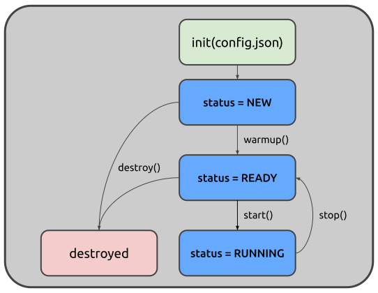

Pipelines
=========

Pipelines act as graph managers and lifecycle coordinators. A pipeline object
knows when to start nodes, how to connect them, and where to store their state.
It transforms a declarative configuration into a running, observable dataflow
system.

At its core, a Pipeline is a configuration interpreter. It doesn't contain
business logic strictly speaking, so its only responsibility is to instantiate
nodes, wire them together according to a graph definition, and manage their
collective lifecycle. This separation of concerns is deliberate: the pipeline
handles topology, while nodes handle data processing and transformation.

The easiest way to interact with Juturna pipelines is through ``JSON`` objects.
The definition of a pipeline graph can be included in a plain ``JSON`` file, and
the library will *compile* it into a pipeline instance. When defining a
pipeline, however, we still need to provide Juturna with a few extra bits of
information.

Configuration items
-------------------

The most basic pipeline configuration file looks something like this:

.. code-block:: json

    {
      "version": "1.0.1",
      "plugins": ["./plugins"],
      "pipeline": {
        "name": "my_awesome_pipeline",
        "id": "1234567890",
        "folder": "./running_pipelines",
        "nodes": [ ],
        "links": [ ]
      }
    }

``version`` refers to the Juturna version in use; this field needs to be
specified, even if it is likely to be removed in the future - as of now, it is
important to keep it to make sure the API version is correct and nothing breaks
apart.

``plugins`` is a collection of directories Juturna will look into when
automatically importing plugin nodes.

``name`` is a symbolic name to assign to the pipeline, and will be used for
logging and static file and artifact management.

``id`` is aunique pipeline identifier, not as handy as the pipeline name but
still required by other tools that might wrap Juturna and manage multiple
pipelines at once. With those tools, pipeline ids are likely to be assigned
automatically in order to prevent overlaps.

``folder`` is the path to the folder where the required pipeline tree will be
created (here is where any files generated by the pipeline are stored).

``nodes`` is the list of nodes composing the pipeline.

``links`` is the list of connections between node pairs.

Once we have this configuration in place, we can go ahead and create the
actual pipeline object.

.. code-block:: python

    import juturna as jt

    pipe = jt.components.Pipeline.from_json('path/to/config.json')

The ``Pipeline`` class constructor accepts a dictionary object:

.. code-block:: python

    import json

    import juturna as jt

    with open('path/to/config.json') as f:
        config = json.load(f)

    pipe = jt.components.Pipeline(config)

Pipeline lifecycle
------------------

Instantiating a pipeline object doesn't really do much. An empty pipeline
container is created, with all the instructions required to build the actual
nodes and linking them.

A pipeline object can be in only three states:

- a ``NEW`` pipeline is freshly created, and can't really do much;
- a ``READY`` pipeline instantiated all the concrete nodes, and acquired
  system and external resources required for its functioning - as the state
  name says, this pipeline is ready to go;
- a ``RUNNING`` pipeline is consuming data sources, processing and sending them,
  so it working (hepefully) just how it is supposed to.

There are 4 main methods to manage a pipeline lifecycle:

``warmup()`` triggers node instantiation and linking, moving a pipeline from
``NEW`` to ``READY``. Internally, this calls the warm up method on every node in
the pipeline. Depending on the resources nodes need to acquire (learning
models, third-party services, network connections), calling the ``warmup`` can
be time-consuming.

``start()`` triggers the beginning of the pipeline workflow, moving its state
from ``READY`` to ``RUNNING``. Internally, this calls the start method on every
node in the pipeline.

``stop()`` interrupts the pipeline execution, moving it from ``RUNNING`` to
``READY``. Again, this call is propagated to every node in the pipe.

``destroy`` can be invoked if any kind of custom memory management should be
performed by any of its composing nodes.

Any call sequence that does not respect the state transitions here discussed
will generate an exception:

#. only a new pipe can be warmed up;
#. only a ready pipe can be started;
#. a running pipeline cannot be destroyed.

.. admonition:: Warming up and configuring
    :class: :NOTE:

    A node defines 2 separate methods to get up and running: ``warmup`` and
    ``configure``. Ideally, you want to use the ``configure`` method to acquire
    resources that need to be acquired externally, so depend not only on the
    node implementation (ports, connections), and the ``warmup`` to prepare the
    node internal status for execution.

.. admonition:: Restarting a pipeline might catch fire (|version|-|release|)
    :class: :ATTENTION:

    Please be aware that the pipeline lifecycle and state transitions do not
    currently support restarting a stopped pipeline. When designing your
    workflow, please assume **pipelines cannot be restarted once stopped, only
    destroyed**. If you need to stop a pipeline and later restart it, destroy it
    and create a new pipe instead.