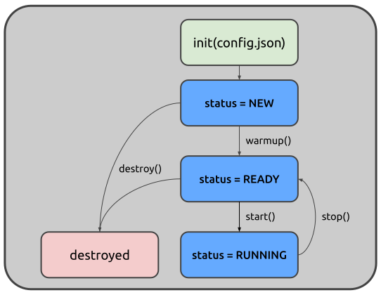

.. _explain_pipelines:

Pipelines
=========

Pipelines act as graph managers and lifecycle coordinators. A pipeline object
knows when to start nodes, how to connect them, and where to store their state.
It transforms a declarative configuration into a running, observable dataflow
system.

At its core, a Pipeline is a configuration interpreter. Strictly speaking, it
doesn't contain business logic, so its only responsibility is to instantiate
nodes, wire them together according to the graph definition, and manage their
collective lifecycle. This separation of concerns is deliberate: the pipeline
handles topology, while nodes handle data processing and transformation.

The easiest way to interact with Juturna pipelines is through ``JSON`` objects.
The definition of a pipeline graph can be included in a plain ``JSON`` file, and
the library will *compile* it into a pipeline instance. When defining a
pipeline, however, we still need to provide Juturna with a few extra bits of
information.

Configuration items
-------------------

The most basic pipeline configuration file looks something like this:

.. code-block:: json

    {
      "version": "1.0.1",
      "plugins": ["./plugins"],
      "pipeline": {
        "name": "my_awesome_pipeline",
        "id": "1234567890",
        "folder": "./running_pipelines",
        "telemetry": "telemetry.csv",
        "nodes": [ ],
        "links": [ ]
      }
    }

``version`` refers to the Juturna version in use; this field needs to be
specified, even if it is likely to be removed in the future - as of now, it is
important to keep it to make sure the API version is correct and nothing breaks
apart.

``plugins`` is a collection of directories Juturna will look into when
automatically importing plugin nodes.

``name`` is a symbolic name to assign to the pipeline, and will be used for
logging and static file and artifact management.

``id`` is a unique pipeline identifier, not as handy as the pipeline name but
still required by other tools that might wrap Juturna and manage multiple
pipelines at once. With those tools, pipeline ids are likely to be assigned
automatically in order to prevent overlaps.

``telemetry`` is an optional field that, when present, enables telemetry data to
be collected in a csv file within the pipeline folder.

``folder`` is the path to the folder where the required pipeline tree will be
created (here is where any files generated by the pipeline are stored). Within
this folder, the configuration file of the pipe will be saved, and each node in
the pipe will be assigned a folder with its own name, where artifacts and data
can be stored.

``nodes`` is the list of nodes composing the pipeline.

``links`` is the list of connections between node pairs.

Once we have this configuration in place, we can go ahead and create the
actual pipeline object.

.. code-block:: python

    import juturna as jt

    pipe = jt.components.Pipeline.from_json('path/to/config.json')

The ``Pipeline`` class constructor also accepts dictionary objects:

.. code-block:: python

    import json

    import juturna as jt

    with open('path/to/config.json') as f:
        config = json.load(f)

    pipe = jt.components.Pipeline(config)

Pipeline lifecycle
------------------

Instantiating a pipeline object doesn't really do much. An empty pipeline
container is created, with all the instructions required to build the actual
nodes and linking them.

A pipeline object can be in one of five states:

- a ``NEW`` pipeline is freshly created, but the nodes within the graph still
  need to be instantiated;
- a ``READY`` pipeline instantiated all the concrete nodes, and acquired
  system and external resources required for its functioning - as the state
  name says, this pipeline is ready to go;
- a ``RUNNING`` pipeline is consuming data sources, processing and sending them,
  so it working (hepefully) just how it is supposed to;
- a ``STOPPED`` pipeline was previously running and has been stopped. This is
  a terminal state: a stopped pipeline **cannot** go back to ``RUNNING``, it
  can only be destroyed;
- a ``DESTROYED`` pipeline released all its resources and is no longer usable.

There are 4 main methods to manage a pipeline lifecycle:

``warmup()`` triggers node instantiation and linking, moving a pipeline from
``NEW`` to ``READY``. Internally, this calls the warm up method on every node in
the pipeline. Depending on the resources nodes need to acquire (learning
models, third-party services, network connections), calling the ``warmup`` can
be time-consuming.

``start()`` triggers the beginning of the pipeline workflow, moving its state
from ``READY`` to ``RUNNING``. Internally, this calls the start method on every
node in the pipeline.

``stop()`` interrupts the pipeline execution, moving it from ``RUNNING`` to
``STOPPED``. Again, this call is propagated to every node in the pipe.

``destroy()`` releases every resource held by the pipeline and its nodes,
moving it to ``DESTROYED`` from any other state (stopping it first if it was
still ``RUNNING``).

Pipeline is the sole owner of this validation: whichever layer calls these
methods (directly, through :class:`PipelineManager`, or through the HTTP
wrapper) observes the same, deterministic behaviour, and the same exception
hierarchy (:mod:`juturna.components`) for illegal calls.

Loopback calls - a method invoked while the pipeline is already in the state
it targets - are **semi-idempotent**: they are a no-op, logged as a warning,
rather than an error. This only applies to the exact target state; every other
call that cannot legally reach that state raises an explicit exception. The
full behaviour, per current state:

- ``NEW``: ``warmup()`` moves to ``READY``; ``start()`` and ``stop()`` raise
  (``PipelineNotReadyError`` / ``PipelineNotRunningError``); ``destroy()``
  moves to ``DESTROYED``.
- ``READY``: ``warmup()`` is a no-op; ``start()`` moves to ``RUNNING``;
  ``stop()`` raises ``PipelineNotRunningError``; ``destroy()`` moves to
  ``DESTROYED``.
- ``RUNNING``: ``warmup()`` raises ``PipelineAlreadyRunningError``;
  ``start()`` is a no-op; ``stop()`` moves to ``STOPPED``; ``destroy()``
  stops the pipeline first, then moves to ``DESTROYED``.
- ``STOPPED``: ``warmup()`` and ``start()`` raise ``PipelineStoppedError``;
  ``stop()`` is a no-op; ``destroy()`` moves to ``DESTROYED``.
- ``DESTROYED``: ``warmup()``, ``start()`` and ``stop()`` raise
  ``PipelineDestroyedError``; ``destroy()`` is a no-op.

.. admonition:: Warming up and configuring
    :class: :NOTE:

    A node defines 2 separate methods to get up and running: ``warmup`` and
    ``configure``. Ideally, you want to use the ``configure`` method to acquire
    resources that need to be acquired externally, so depend not only on the
    node implementation (ports, connections), and the ``warmup`` to prepare the
    node internal status for execution.

.. admonition:: Restarting a pipeline is not supported
    :class: :ATTENTION:

    A pipeline that has been stopped moves to the ``STOPPED`` state and
    **cannot** be started again: calling ``start()`` or ``warmup()`` on it
    raises ``PipelineStoppedError``. If you need to stop a pipeline and later
    restart the same workflow, destroy it and create a new pipe instead.

Concurrent lifecycle calls
---------------------------

Only one of ``warmup()``/``start()``/``stop()``/``destroy()`` can be in
flight on a given pipeline at a time. Internally, a transition is *claimed*
before its actual work starts (instantiating nodes, starting them, sending
the stop signal to every node, tearing them down), and the pipeline's
reported ``status`` is only updated once that work has genuinely finished -
never before, and never optimistically.

This has two consequences:

- ``status`` is always truthful. A slow ``warmup()`` (loading a model,
  opening a remote connection) keeps reporting ``NEW`` for as long as it
  actually takes, not ``READY`` from the instant it was called.
- a lifecycle call that arrives while another one is still being processed
  on the *same* pipeline raises ``PipelineStateError``'s ``PipelineBusyError``
  subclass, instead of being evaluated against a status that hasn't caught up
  with reality yet - which would otherwise let it race against internal
  state (nodes, DAG) the in-flight transition is still mutating.

``PipelineBusyError`` is a different situation from the semi-idempotent
no-op described above: a no-op happens when the pipeline has *already
reached* the target state; ``PipelineBusyError`` happens when it is *in the
process of reaching* some state, possibly a different one. Concretely: two
overlapping calls to ``stop()`` on a running pipeline do not both drain and
signal every node - the second one raises immediately, and the underlying
work runs exactly once.

.. admonition:: Retrying after PipelineBusyError
    :class: :NOTE:

    ``PipelineBusyError`` is transient: it means "another operation on this
    pipeline is still in progress", not "this call is illegal". A caller that
    receives it should wait (optionally polling ``status``) and retry, rather
    than treating it like the other lifecycle exceptions.
