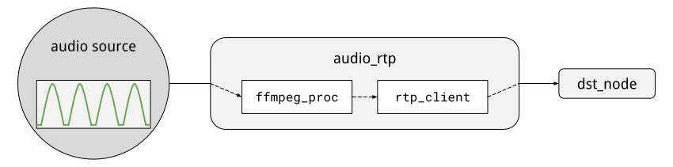

##############
Built-in nodes
##############

Source
======

``audio_rtp``
-------------
This node consumes a remote RTP audio stream, and makes it available to its
destinations as chunks of a configurable length.

Internally, ``audio_rtp`` spawns a local ``ffmpeg`` thread that will receive
the stream on a port picked at runtime and make it available to a local RTP
client.

This approach allows to demand all the decode-encode heavy lifting to
``ffmpeg``.

+------------------+----------+----------------------------------------+
| argument         | type     | description                            |
+==================+==========+========================================+
| ``rec_host``     | ``str``  | the host from which the stream will be |
|                  |          | received                               |
+------------------+----------+----------------------------------------+
| ``trx_host``     | ``str``  | the host of the local RTP client       |
|                  |          | (usually ``127.0.0.1``)                |
+------------------+----------+----------------------------------------+
| ``rec_port``     | ``int``  | the port of the RTP client             |
+------------------+----------+----------------------------------------+
| ``trx_port``     | ``int``  | the port of the local RTP stream       |
+------------------+----------+----------------------------------------+
| ``audio_rate``   | ``int``  | rate of the receiving audio            |
+------------------+----------+----------------------------------------+
|  ``block_size``  | ``int``  | length (in seconds) of the audio chunks|
|                  |          | to generate                            |
+------------------+----------+----------------------------------------+
|  ``channels``    | ``int``  | number of channels of the receiving    |
|                  |          | audio                                  |
+------------------+----------+----------------------------------------+
| ``payload_type`` | ``dict`` | payload type as specified in the       |
|                  |          | incoming stream                        |
+------------------+----------+----------------------------------------+

During the warmup phase, this node will write in its node folder the sdp file
with all the relevant information about the local stream.

Nodes:

- the node automatically selects a receiving port if ``rec_port`` is set to
  ``auto`` in the configuration, otherwise will use the provided port; the same
  applies to the local transmitting port
- this node accumulates audio samples until the temporal length of all the
  samples reach ``block_size``, computed in seconds; this length is computed
  using ``audio_rate``, so make sure it matches the sources'

``audio_file``
--------------
This node loads an audio file, and makes it available to any destinations node
in chunks of a coinfigurable length.

+------------------+----------+----------------------------------------+
| argument         | type     | description                            |
+==================+==========+========================================+
| ``file_source``  | ``str``  | path of the source audio file          |
+------------------+----------+----------------------------------------+
| ``audio_rate``   | ``int``  | rate of the audio file                 |
+------------------+----------+----------------------------------------+
|  ``block_size``  | ``int``  | length (in seconds) of the audio chunks|
|                  |          | to generate                            |
+------------------+----------+----------------------------------------+

``video_rtp``
-------------
This node consumes a remote RTP video stream, and makes it available to its
destinations as either individual frames or collections of frames, depending on
its working mode. Internally, it uses ``opencv-python`` to open the generated
sdp file.

+--------------------+----------+----------------------------------------+
| argument           | type     | description                            |
+====================+==========+========================================+
| ``rec_host``       | ``str``  | the host from which the stream will be |
|                    |          | received                               |
+--------------------+----------+----------------------------------------+
| ``mode``           | ``str``  | node operating mode (``still`` or      |
|                    |          | ``video``)                             |
+--------------------+----------+----------------------------------------+
| ``rate``           | ``int``  | number of frames to read every second  |
+--------------------+----------+----------------------------------------+
| ``fps``            | ``int``  | video source frames per second         |
+--------------------+----------+----------------------------------------+
| ``video_duration`` | ``int``  | video source frames per second         |
+--------------------+----------+----------------------------------------+
| ``codec``          | ``int``  | the codec of the source stream         |
+--------------------+----------+----------------------------------------+
| ``payload_type``   | ``dict`` | payload type as specified in the       |
|                    |          | incoming stream                        |
+--------------------+----------+----------------------------------------+

Notes:

- when ``mode == 'still'`` the node reads a number of frame every second, thus
  ``rate`` is required in the configuration and ``fps`` will be ignored
- when ``mode == 'video'`` the node uses ``fps`` to determine the length of the
  buffered video, sending it once it reaches ``video_duration``, thus ``rate``
  will be ignored

``video_device``
----------------
This node reads the video source from a local capturing device, and makes it
available to its destination in the form of either individual frames, sampled
at a configurable rate, or chunks of frames of a configurable temporal
length. Its working principle is the same as ``video_rtp``.

+-----------------------+----------+----------------------------------------+
| argument              | type     | description                            |
+=======================+==========+========================================+
| ``capture_device_id`` | ``str``  | the host from which the stream will be |
|                       |          | received                               |
+-----------------------+----------+----------------------------------------+
| ``mode``              | ``str``  | node operating mode (``still`` or      |
|                       |          | ``video``)                             |
+-----------------------+----------+----------------------------------------+
| ``rate``              | ``int``  | number of frames to read every second  |
+-----------------------+----------+----------------------------------------+
| ``fps``               | ``int``  | video source frames per second         |
+-----------------------+----------+----------------------------------------+
| ``video_duration``    | ``int``  | video source frames per second         |
+-----------------------+----------+----------------------------------------+
| ``width``             | ``int``  | width of the produced frames           |
+-----------------------+----------+----------------------------------------+
| ``height``            | ``int``  | height of the produced frames          |
+-----------------------+----------+----------------------------------------+

Sink
====

``notifier_http``
-----------------
A simple notifier that transmits data to a HTTP endpoint.

+------------------+----------+---------------------------------+
| argument         | type     | description                     |
+==================+==========+=================================+
| ``endpoint``     | ``str``  | destination endpoint            |
+------------------+----------+---------------------------------+
| ``timeout``      | ``int``  | transmission timeout in seconds |
+------------------+----------+---------------------------------+
| ``content_type`` | ``str``  | type of data to transmit        |
+------------------+----------+---------------------------------+

Notes:

- the node currently supports transmission of json and text data, for which the
  ``content_type`` values are ``application/json`` and ``application/text``
  respectively
- the node will transmit the faw data contained in the payload of the update
  messages it receives, so that should match the transmission data type

``notifier_websocket``
----------------------
A transmission node that transmits data to a websocket endpoint.

+------------------+----------+---------------------------------+
| argument         | type     | description                     |
+==================+==========+=================================+
| ``endpoint``     | ``str``  | destination endpoint            |
+------------------+----------+---------------------------------+

Notes:

- the node sends to its endpoint the serialised content of the update message
  payload, retrieved using ``json.dumps(message.payload)``
- currently, the node reconnects to the destination endpoint every time there
  is a message to transmit, so the connection is not persistent

``videostream_ffmpeg``
----------------------
A transmission node that receives update messages containing frames, and
transmits them over a destination endpoint. Internally, the node creates a
``ffmpeg`` process and whenever an update message is available, writes its
content to the process standard input.

+------------------+----------+---------------------------------+
| argument         | type     | description                     |
+==================+==========+=================================+
| ``dst_host``     | ``str``  | destination host                |
+------------------+----------+---------------------------------+
| ``dst_port``     | ``int``  | destination port                |
+------------------+----------+---------------------------------+
| ``in_width``     | ``int``  | width of the received frame     |
+------------------+----------+---------------------------------+
| ``in_height``    | ``int``  | height of the received frame    |
+------------------+----------+---------------------------------+

Notes:

- this node is still experimental, as many of the options provided to the
  underlying ``ffmpeg`` process are still not included in the configuration
