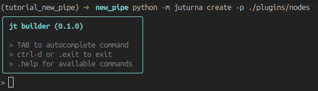
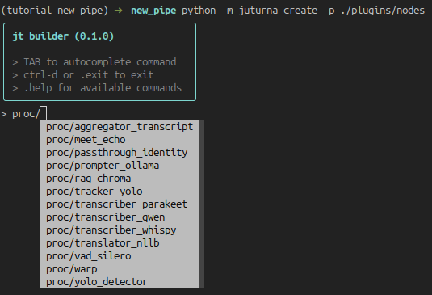
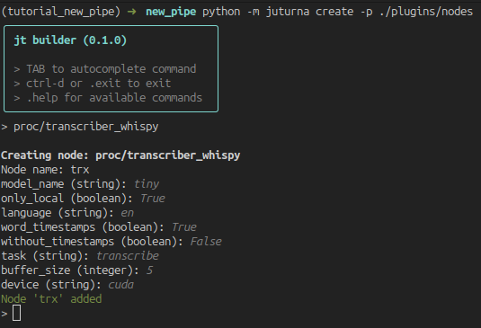
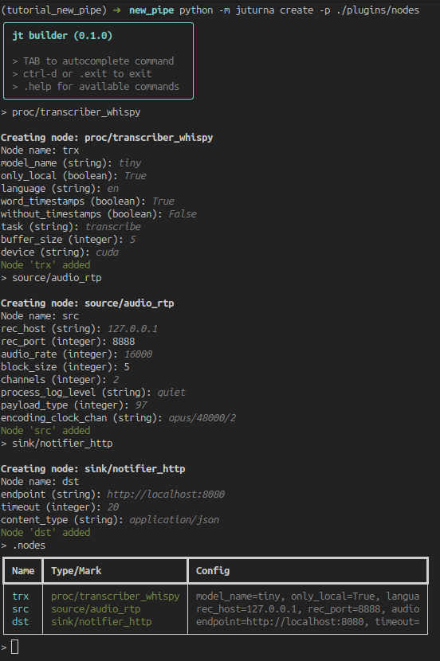
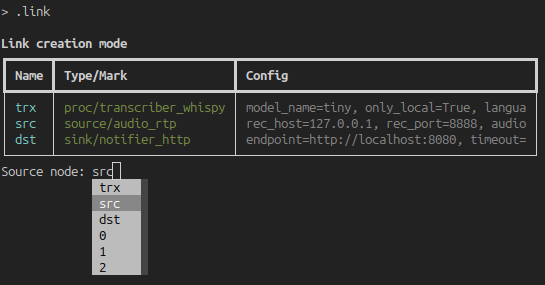
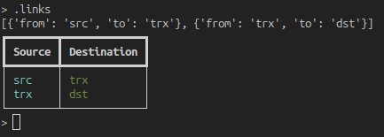
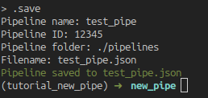

Create pipelines
================

This documentation page will give you an overview of how to create a pipeline in
juturna. As the focus here is the pipeline itself, we will not be using custom
nodes but rather built-in and plugin nodes already available in the juturna
repository.

Setup the environment
---------------------

As usual, we prepare the environment including juturna and all the required
dependencies. This time we will pull the library straight from GitHub, so that
we can also fetch the plugin nodes.

.. code-block:: console

    user:~/prj$ python3 -m venv .venv
    user:~/prj$ source .venv/bin/activate
    (.venv) user:~/prj$ git clone https://github.com/meetecho/juturna
    (.venv) user:~/prj$ pip install "./juturna[pipebuilder]"
    (.venv) user:~/prj$ cp -r ./juturna/plugins ./
    (.venv) user:~/prj$ rm -rf juturna

Note that we installed juturna including the ``pipebuilder`` group, which
installs the dependencies for a CLI tool we can use to automatically build
configuration files.

Create the pipeline configuration file
--------------------------------------

A pipeline configuration file is a simple json file that can be fed to juturna.
This file can be created manually, or as we said we can use the CLI utility
shipped with the library. We can just go ahead and launch it:

.. code-block:: console

    (.venv) user:~/prj$ python -m juturna create -p ./plugins/nodes

The pipe builder looks like this:

The tool offers autocompletion, and automatically scans the built-in and plugin
nodes so that their types are included as commands. Regular commands are
prepended with a dot.

To create a new node, press TAB to see all the available commands. When a node
type is selected, add a ``/`` to see all available nodes of that type.

Selecting a node will bring up the configuration prompt. Except for fields such
as the node name, all other fields will be defaulted to the values in the node
toml file.

When we are done adding all the nodes, we can look at the full list using
``.nodes``.

Links can be added with the ``.link`` command. It will prompt the full list of
nodes, autocompleting node names to include in source and destination of every
new link. TAB autocompletion is also available for the node names.

Once we are done, we can look at the full list of links with ``.links``.

Lastly, the ``.save`` command will start the saving process, where we will be
picking the pipe name, its id and running folder, and the name of the file we
want to save its configuration to.

In this example, we built a pipeline containing a audio RTP source node, a
transcription node, and a HTTP transmitter that will send the results to a
configured endpoint. The saved file (which we could have written manually) looks
like this:

.. code-block:: json

    {
      "version": "0.1.0",
      "plugins": ["./plugins"],
      "pipeline": {
        "name": "test_pipe",
        "id": "12345",
        "folder": "./pipelines",
        "nodes": [
          {
            "name": "trx",
            "type": "proc",
            "mark": "transcriber_whispy",
            "configuration": {
              "model_name": "tiny",
              "only_local": true,
              "language": "en",
              "word_timestamps": true,
              "without_timestamps": false,
              "task": "transcribe",
              "buffer_size": 5,
              "device": "cuda"
            }
          },
          {
            "name": "src",
            "type": "source",
            "mark": "audio_rtp",
            "configuration": {
              "rec_host": "127.0.0.1",
              "rec_port": 8888,
              "audio_rate": 16000,
              "block_size": 5,
              "channels": 2,
              "process_log_level": "quiet",
              "payload_type": 97,
              "encoding_clock_chan": "opus/48000/2"
            }
          },
          {
            "name": "dst",
            "type": "sink",
            "mark": "notifier_http",
            "configuration": {
              "endpoint": "http://localhost:8080",
              "timeout": 20,
              "content_type": "application/json"
            }
          }
        ],
        "links": [
          {
            "from": "src",
            "to": "trx"
          },
          {
            "from": "trx",
            "to": "dst"
          }
        ]
      }
    }

Installing extra dependencies
-----------------------------

In the pipeline we are building as example, there is only one plugin node. This
node is likely to carry extra dependencies with it, so we need to installing
them before launching the pipeline. In our case, we can see that the transcriber
node requires ``ctranslate2`` and ``faster-whisper``, so we go ahead and
install them.

.. code-block:: console

    (.venv) user:~/prj$ pip install faster-whisper ctranslate2

Juturna also offers a way of collecting all the dependencies defined across
plugin nodes. This can be done from the command line:

.. code-block:: console

  (.venv) user:~/prj$ python -m juturna require \
                             -c test_pipe.json \
                             -p ./plugins \
                             -s ./requirements.txt
  (.venv) user:~/prj$ pip install -r requirements.txt

Launch the pipe
---------------

At this point, we are ready to execute the pipeline!

.. code-block:: console

    (.venv) user:~/prj$ python -m juturna launch -c test_pipe.json

This will start the pipeline, and create the ``./pipelines`` folder for us.
